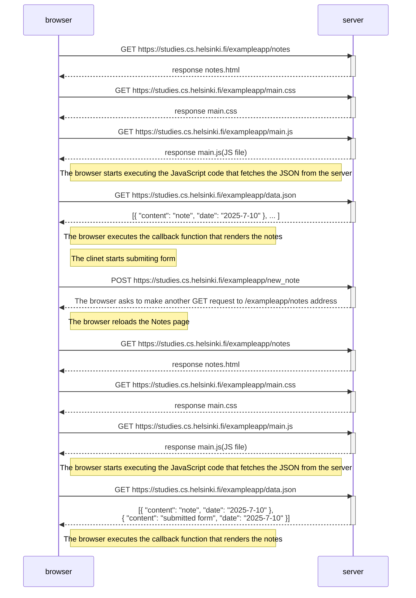

```mermaid
sequenceDiagram
    participant browser
    participant server

    browser->>server: GET https://studies.cs.helsinki.fi/exampleapp/notes
    activate server
    server-->>browser: response notes.html
    deactivate server

    browser->>server: GET https://studies.cs.helsinki.fi/exampleapp/main.css
    activate server
    server-->>browser: response main.css
    deactivate server

    browser->>server: GET https://studies.cs.helsinki.fi/exampleapp/main.js
    activate server
    server-->>browser: response main.js(JS file)
    deactivate server

    Note right of browser: The browser starts executing the JavaScript code that fetches the JSON from the server

    browser->>server: GET https://studies.cs.helsinki.fi/exampleapp/data.json
    activate server
    server-->>browser: [{ "content": "note", "date": "2025-7-10" }, ... ]
    deactivate server

    Note right of browser: The browser executes the callback function that renders the notes

    Note right of browser: The clinet starts submiting form

    browser ->> server: POST https://studies.cs.helsinki.fi/exampleapp/new_note
    activate server
    server -->> browser: The browser asks to make another GET request to /exampleapp/notes address 
    deactivate server

    Note right of browser: The browser reloads the Notes page

    browser->>server: GET https://studies.cs.helsinki.fi/exampleapp/notes
    activate server
    server-->>browser: response notes.html
    deactivate server

    browser->>server: GET https://studies.cs.helsinki.fi/exampleapp/main.css
    activate server
    server-->>browser: response main.css
    deactivate server

    browser->>server: GET https://studies.cs.helsinki.fi/exampleapp/main.js
    activate server
    server-->>browser: response main.js(JS file)
    deactivate server

    Note right of browser: The browser starts executing the JavaScript code that fetches the JSON from the server

    browser->>server: GET https://studies.cs.helsinki.fi/exampleapp/data.json
    activate server
    server-->>browser: [{ "content": "note", "date": "2025-7-10" },<br> { "content": "submitted form", "date": "2025-7-10" }]
    deactivate server

    Note right of browser: The browser executes the callback function that renders the notes

```