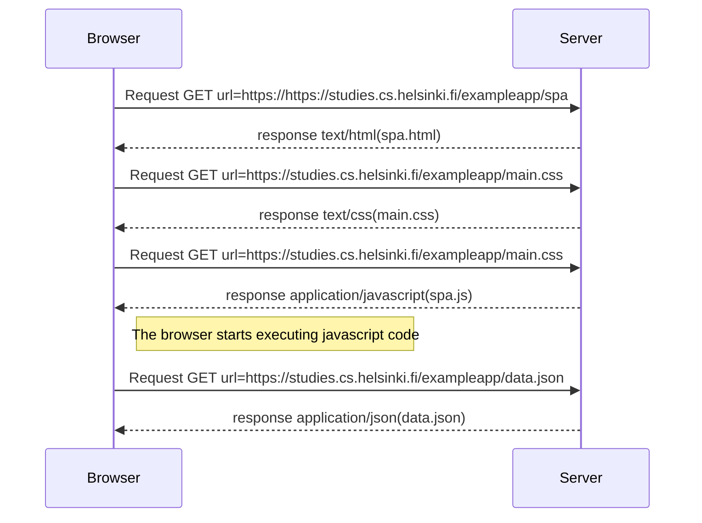

```mermaid
sequenceDiagram
    participant Browser 
    participant Server

    Browser->>Server: Request GET url=https://https://studies.cs.helsinki.fi/exampleapp/spa
    Server -->> Browser: response text/html(spa.html)
    Browser->>Server: Request GET url=https://studies.cs.helsinki.fi/exampleapp/main.css
    Server -->> Browser: response text/css(main.css)
    Browser->>Server: Request GET url=https://studies.cs.helsinki.fi/exampleapp/main.css
    Server -->> Browser: response application/javascript(spa.js)

    Note right of Browser: The browser starts executing javascript code

    Browser->>Server: Request GET url=https://studies.cs.helsinki.fi/exampleapp/data.json
    Server -->> Browser: response application/json(data.json)
```